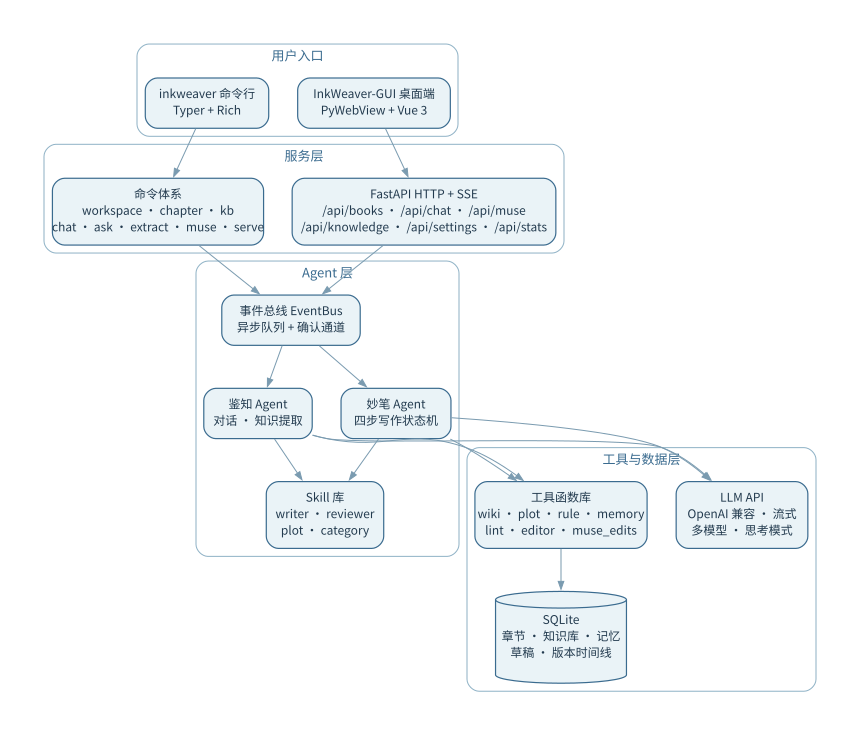
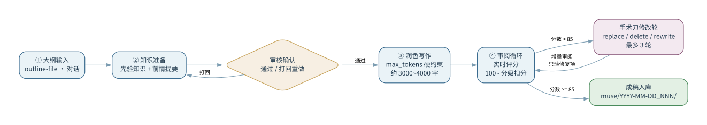

# InkWeaver-CLI（墨笔）

> **让 AI 成为你的创作伙伴：一部小说从导入、建库到智能写作，全流程自动化。**

**墨笔（InkWeaver）** 是面向网文作者的 LLM Agent 写作工具。它不只帮你写——它先**读懂**你的小说：自动提取人物、势力、功法、剧情线，构建可查询、可关联、可演进的知识库；再基于这份"世界记忆"，与你对话答疑、按大纲续写章节，并以审阅循环保证质量。

当前版本：**v7.0.0**（MCP 服务器 · 三通路接入 · 事件总线架构 · 妙笔四步写作工作流）

---

## 三种接入方式（v7.0.0）

v7.0.0 起，InkWeaver 的全部能力通过三条通路对外提供，任选其一或组合使用：

| 通路 | 启动命令 | 面向场景 | 文档 |
|------|----------|----------|------|
| **CLI** | `inkweaver chat / ask / extract / muse ...` | 终端工作台，作者直接使用 | [README-CLI.md](README-CLI.md) |
| **HTTP API** | `inkweaver serve` | GUI 桌面端 / 第三方客户端（RESTful + SSE） | [README-API.md](README-API.md) |
| **MCP Server** | `inkweaver mcp` | 任意支持 MCP 的 Agent（Qoder / Claude Desktop / Cursor 等）即插即用 | [README-MCP.md](README-MCP.md) |

三条通路共用同一套核心（鉴知 Agent、妙笔工作流、SQLite 知识库），行为一致、数据互通。

```
                    ┌──────────────┐
   终端作者 ──CLI──►│              │
                    │  InkWeaver   │──► SQLite 知识库（wiki/rule/plot/memory）
  GUI/客户端 ─API──►│  核心引擎     │──► 章节库 / 草稿 / 会话
                    │              │
  coding Agent─MCP─►│              │──► 妙笔产物目录（muse/）
                    └──────────────┘
```

---

## 产品特性

| 能力 | 说明 |
|------|------|
| **鉴知对话** | 基于全书知识库的智能问答，回答引用词条、剧情、规则，而非凭空猜测 |
| **知识提取** | 一键扫描章节，自动生成人物/势力/地图词条、剧情卡片与世界观规则，全程可审阅 |
| **妙笔写作** | 大纲 → 知识准备 → 写作 → 审阅打回的完整创作闭环，支持章节锚定与版本追溯 |
| **关系网络** | `[[双链]]` 自动构建实体关系图，断链自动检测并按重要性分级处理 |
| **持久记忆** | 偏好/观察/纠正/风格四类结构化记忆，Agent 可读可写，越用越懂你 |
| **HTTP API** | 内置 FastAPI 服务 + SSE 流式事件，为 GUI 桌面端与第三方客户端提供能力 |
| **MCP Server** | 31 个 MCP 工具 + 4 个标准 Agent Skills 包，任意 coding Agent 即插即用（v7.0.0） |

---

## 快速开始（5 分钟上手）

### 1. 安装

```bash
cd InkWeaver-CLI
pip install -e .        # 完整安装（推荐）
# 或仅安装依赖：
pip install -r requirements.txt
```

### 2. 配置模型

编辑 `.env/config.yaml`（多模型 + 角色分配，兼容任意 OpenAI 格式的 LLM）：

```yaml
models:
  - id: "model_001"
    name: "DeepSeek V4 Flash"
    provider: "deepseek"
    api_key: sk-your-api-key-here
    model: deepseek-v4-flash
    base_url: https://api.deepseek.com
    output_max_tokens: 128000

assignments:
  chat: "model_001"        # 鉴知对话
  extract: "model_001"     # 知识提取
  write: "model_001"       # 妙笔写作
  review: "model_001"      # 审阅

workspace:
  dir: ../workingArea
  last: ""
```

四个角色可分别绑定不同模型（例如写作用强模型、对话用快模型）。`.env/` 已被 `.gitignore` 排除，密钥不会入库。

### 3. 完成第一次创作闭环

```bash
# ① 新建工作区并导入小说
inkweaver workspace create 我的小说
inkweaver chapter import novel.txt -w 我的小说 --yes

# ② 提取全书知识（自动分析章节范围）
inkweaver extract -w 我的小说 --yes

# ③ 问它任何书内问题（基于知识库回答）
inkweaver ask "林凡的修炼体系是什么？" -w 我的小说

# ④ 按大纲续写下一章（自动锚定最新章节）
inkweaver muse --outline-file 大纲.txt -w 我的小说 --yes

# ⑤ 进入沉浸式对话工作台
inkweaver chat -w 我的小说
```

> 提示：`--yes` 跳过确认进入全自动模式；去掉后每个关键步骤（提取计划、写作大纲）都会先征求你的意见。

### 4. 接入 coding Agent（v7.0.0 新增）

以 Qoder 为例，在 `%APPDATA%\QoderCN\SharedClientCache\mcp.json` 注册：

```json
{
  "mcpServers": {
    "inkweaver": {
      "command": "<python 解释器绝对路径>",
      "args": ["main.py", "mcp"],
      "cwd": "<InkWeaver-CLI 目录绝对路径>"
    }
  }
}
```

之后在 Qoder 中直接说"帮我给《补天纪》续写一章"即可。完整指南见 [README-MCP.md](README-MCP.md)。

---

## 系统架构



**线程模型与确认机制：**

- `Thread-Main` 用户输入 / UI 交互；`Thread-Agent` Agent 主循环（工具调用天然串行）；`Thread-Consumer` 事件消费（CLI 打印 / GUI 推送 / MCP 进度轨迹）
- Agent 需要决策时通过 `bus.request_confirm()` 阻塞等待，消费侧把确认请求展示给用户（CLI 交互 / GUI 卡片 / MCP `task_confirm`），响应后唤醒 Agent——**每一步关键操作都由你把关**

---

## 核心功能

### 妙笔写作：四步创作闭环



- `--yes` 全自动：审阅分数 < 85 自动打回重写（最多 3 轮）
- `--chapter N` 章节锚定：知识版本硬切，只使用 ≤ N-1 章的知识，避免"未来剧透"
- R2+ 修改轮采用手术刀式 JSON 编辑（replace_text / delete_text / rewrite_paragraph），不全文重写，保留思维链
- 审阅器增量模式：只验证上轮 issues 是否修复与新引入问题，实时评分（100 - 分级扣分）
- 输出保存在 `{workspace}/muse/YYYY-MM-DD_NNN/`，成稿可一键发布为正式章节

### 知识提取：三阶段流水线

1. **规划**：Agent 分析章节 → 对比现有知识库 → 生成新增/编辑计划 → 用户确认（`--yes` 跳过）
2. **执行**：写入 SQLite → 构建关系图 → 记录 log.json → lint 检查
3. **审阅**：断链检测 → 三维重要性评分（提及数/词频/章节范围）→ 分级处理（自动解链 / LLM 判断 / 强制创建）

### 知识系统：三类结构化知识

| 类型 | 说明 |
|------|------|
| **Wiki** | 按类别组织的实体词条（人物/势力/地图/功法等），含状态字段与版本时间线 |
| **Plot** | 剧情卡片，绑定章节区间，有「未结束/已结束」生命周期 |
| **Rule** | 世界观规则文档（如境界体系） |

全部通过 `[[wikilink]]` 交叉引用，自动构建关系图，支持 `kb relation` 查询。

### 记忆系统：四类结构化记忆

| 分类 | 用途 |
|------|------|
| preference | 用户偏好（对话 prompt 注入） |
| observation | 观察记录 |
| correction | 纠正信息（计划打回时触发） |
| style | 写作风格（妙笔 prompt 注入） |

Agent 工具：`memory_query` / `memory_write` / `memory_update` / `memory_forget`

---

## 工作区结构

```
workingArea/
├── 我的小说/
│   ├── wiki.db              # SQLite 数据库（章节 + 知识库 + 记忆 + 草稿）
│   ├── session/             # 对话日志归档（JSONL，按会话）
│   ├── muse/                # 妙笔输出目录
│   ├── log.json             # 提取记录 & 文档哈希
│   ├── relations.yaml       # 关系图
│   └── lint-debt.json       # Lint 债务报告（含重要性评分）
└── ...
```

---

## 技术栈

| 层 | 技术 |
|----|------|
| 语言 | Python 3.10+ |
| CLI 框架 | typer（基于 rich） |
| LLM 接口 | OpenAI SDK（兼容任意 OpenAI 格式推理模型，流式 + 思考模式） |
| 数据存储 | SQLite（章节 + 知识库 + 版本时间线 + 记忆 + 草稿 + 会话） |
| 配置 | YAML（多模型 + 角色分配） |
| Token 估算 | tiktoken（cl100k_base） |
| 事件总线 | queue.Queue + threading.Event（线程安全，批量发射防风暴） |
| HTTP 服务 | FastAPI + uvicorn + SSE |
| MCP 服务 | mcp SDK（FastMCP，stdio / streamable-http，v7.0.0） |
| GUI | PyWebView + Vue 3（独立仓库 [InkWeaver-GUI](../InkWeaver-GUI)） |

---

## 项目结构

```
InkWeaver-CLI/
├── main.py                 # typer app 入口
├── commands/               # 子命令实现
│   ├── workspace.py / chapter.py / kb.py / settings.py
│   ├── chat.py             # chat REPL + 事件消费
│   ├── ask.py / extract.py / muse_cmd.py
│   ├── serve.py            # FastAPI 启动
│   └── mcp_cmd.py          # MCP Server 启动（v7.0.0）
├── core/                   # 核心层
│   ├── events.py           # EventBus + StreamBatcher
│   ├── io.py               # IOChannel 统一 I/O 通道
│   ├── output.py           # OutputFormatter（人类/JSON 双模式）
│   └── session.py          # SessionLogger 会话日志
├── agent/                  # Agent 核心
│   ├── base.py             # BaseAgent（bus 驱动 + token 任务级隔离）
│   ├── loop.py             # agent_loop 主循环（流式 chat_stream）
│   ├── compact.py / permission.py / skill.py / todo.py
│   └── knowledge.py        # 知识提取子代理
├── tools/                  # 工具函数
│   ├── db/                 # SQLite 数据层（service/schema/proxy/token_stats/version_manager）
│   ├── workspace.py / chapter.py / wiki.py / plot.py / rules.py
│   ├── relation.py / memory.py / editor.py / lint.py / name_utils.py
│   ├── muse_edits.py       # 手术刀编辑后端
│   ├── writing_workflow.py # 写作工作流（max_tokens 硬约束）
│   ├── knowledge_task.py / plot_task.py / review.py   # Subagent
│   └── knowledge_workflow.py / plot_workflow.py       # 知识准备工作流
├── skills/                 # 内部 Skill 文件（注入 system prompt）
├── skills-agent/           # 对外 Agent Skills 包（开放标准，v7.0.0）
├── muse/                   # 妙笔子包
│   ├── agent.py            # MuseAgent 工具分发 + 版本硬切
│   ├── workflow.py         # 四步写作状态机（WRITE_MAX_TOKENS）
│   └── review_session.py   # 审阅状态管理
├── server/                 # FastAPI HTTP 服务
│   ├── main.py             # 应用实例 + 静态托管 + 健康检查
│   ├── state.py / sse.py   # 全局状态 / SSE 推送
│   └── router/             # books/chat/muse/knowledge/sessions/settings/stats
├── mcp_server/             # MCP Server（v7.0.0 新增）
│   ├── context.py          # 配置加载 + 工作区解析
│   ├── tasks.py            # 异步任务注册表（TaskManager）
│   ├── tools_read.py       # 16 个只读工具
│   ├── tools_write.py      # 6 个写操作工具
│   ├── tools_agent.py      # 3 个子智能体任务 + 6 个任务管理工具
│   └── server.py           # FastMCP 组装 + 传输启动
├── api.py                  # LLMClient（chat/chat_stream，支持 max_tokens）
├── Jianzhi.py              # 鉴知 Agent
└── pyproject.toml          # 包定义 + entry_points
```

---

## 版本历史摘要

| 版本 | 主题 |
|------|------|
| v5.2 | 标准 CLI 化（typer 重构、子命令体系、JSON 输出） |
| v5.3 | 妙笔章节锚定 + 记忆系统重做（DB 存储） |
| v5.4 | 妙笔稳定性重构：手术刀编辑 + 增量审阅 + 断链重要性评分 |
| v6.0 | 事件总线架构改造 + GUI 桌面端（独立仓库） |
| v6.2 | FastAPI 后端迁移（HTTP API、SSE 流式） |
| v6.3 | Code Review 全量修复 + 安全加固 |
| v6.5.x | 前后端联动迭代：确认卡片、实时评分、token 按会话隔离、知识准备两步视图、写作链路质量加固、事件风暴治理、修改标注 |
| **v7.0.0** | **MCP 服务器改造**：31 个 MCP 工具（只读/写/子智能体三层）+ 异步任务模型 + 4 个标准 Agent Skills 包；README 拆分为 CLI/API/MCP 三版（原 API.md 内容融入 README-API.md） |

---

## 相关项目

- [InkWeaver-GUI](../InkWeaver-GUI) — 墨笔桌面端 / Web 界面（青花瓷·水墨风），基于本仓库 FastAPI 后端
- [README-CLI.md](README-CLI.md) — CLI 完整使用手册
- [README-API.md](README-API.md) — HTTP API 接口完整参考（含原 API.md 全部内容）
- [README-MCP.md](README-MCP.md) — MCP Server 接入指南与工具清单
